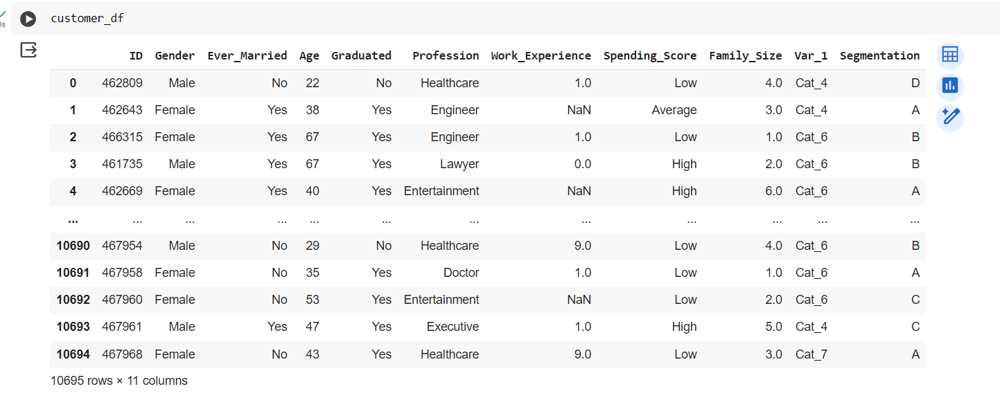
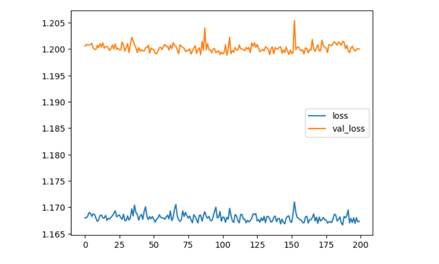
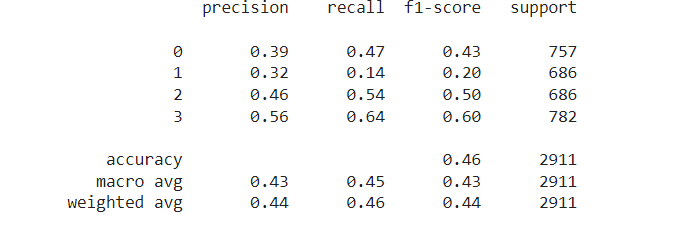

# Developing a Neural Network Classification Model

## AIM

To develop a neural network classification model for the given dataset.

## Problem Statement

An automobile company has plans to enter new markets with their existing products. After intensive market research, they’ve decided that the behavior of the new market is similar to their existing market.

In their existing market, the sales team has classified all customers into 4 segments (A, B, C, D ). Then, they performed segmented outreach and communication for a different segment of customers. This strategy has work exceptionally well for them. They plan to use the same strategy for the new markets.

You are required to help the manager to predict the right group of the new customers.

## Neural Network Model

Include the neural network model diagram.

## DESIGN STEPS

## STEP 1:
Import the necessary packages & modules

## STEP 2:
Load and clean the customer data, handling missing values.

## STEP 3:
Use OrdinalEncoder and LabelEncoder to encode categorical features.

## STEP 4:
Generate a correlation matrix and heatmap, along with a pair plot for data exploration.

## STEP 5:
Apply MinMax scaling to the 'Age' column in the dataset.

## STEP 6:
Create a neural network model using TensorFlow/Keras with specified layers and activation functions.

## STEP 7:
Train the model on the scaled training data with early stopping for preventing overfitting.

## STEP 8:
Evaluate the trained model on the test data, save the model, and store necessary data for future predictions.
## PROGRAM

### Name: MADHAN BABU P
### Register Number:212222230075

```python
import pandas as pd
from sklearn.model_selection import train_test_split
from tensorflow.keras.models import Sequential
from tensorflow.keras.models import load_model
import pickle
from tensorflow.keras.layers import Dense
from tensorflow.keras.layers import Dropout
from tensorflow.keras.layers import BatchNormalization
import tensorflow as tf
import seaborn as sns
from tensorflow.keras.callbacks import EarlyStopping
from sklearn.preprocessing import MinMaxScaler
from sklearn.preprocessing import LabelEncoder
from sklearn.preprocessing import OneHotEncoder
from sklearn.preprocessing import OrdinalEncoder
from sklearn.metrics import classification_report,confusion_matrix
import numpy as np
import matplotlib.pylab as plt

customer_df = pd.read_csv('customers.csv')
customer_df.columns
customer_df.dtypes
customer_df.shape
customer_df_cleaned = customer_df.dropna(axis=0)
customer_df_cleaned.isnull().sum()
customer_df_cleaned.shape
customer_df_cleaned.dtypes
customer_df_cleaned['Gender'].unique()
customer_df_cleaned['Ever_Married'].unique()
customer_df_cleaned['Graduated'].unique()
customer_df_cleaned['Profession'].unique()
customer_df_cleaned['Spending_Score'].unique()
customer_df_cleaned['Var_1'].unique()
customer_df_cleaned['Segmentation'].unique()
categories_list=[['Male', 'Female'],
           ['No', 'Yes'],
           ['No', 'Yes'],
           ['Healthcare', 'Engineer', 'Lawyer', 'Artist', 'Doctor',
            'Homemaker', 'Entertainment', 'Marketing', 'Executive'],
           ['Low', 'Average', 'High']
           ]
enc = OrdinalEncoder(categories=categories_list)

customers_1 = customer_df_cleaned.copy()

customers_1[['Gender',
             'Ever_Married',
              'Graduated','Profession',
              'Spending_Score']] = enc.fit_transform(customers_1[['Gender',
                                                                 'Ever_Married',
                                                                 'Graduated','Profession',
                                                                 'Spending_Score']])

customers_1.dtypes

le = LabelEncoder()
customers_1['Segmentation'] = le.fit_transform(customers_1['Segmentation'])
customers_1.dtypes

customers_1 = customers_1.drop('ID',axis=1)
customers_1 = customers_1.drop('Var_1',axis=1)

customers_1.dtypes

corr = customers_1.corr()

sns.heatmap(corr,
        xticklabels=corr.columns,
        yticklabels=corr.columns,
        cmap="BuPu",
        annot= True)

sns.pairplot(customers_1)

sns.distplot(customers_1['Age'])

plt.figure(figsize=(10,6))
sns.countplot(customers_1['Family_Size'])

plt.figure(figsize=(10,6))
sns.boxplot(x='Family_Size',y='Age',data=customers_1)

plt.figure(figsize=(10,6))
sns.scatterplot(x='Family_Size',y='Spending_Score',data=customers_1)

plt.figure(figsize=(10,6))
sns.scatterplot(x='Family_Size',y='Age',data=customers_1)

customers_1.describe()

customers_1['Segmentation'].unique()

X=customers_1[['Gender','Ever_Married','Age','Graduated','Profession','Work_Experience','Spending_Score','Family_Size']].values

y1 = customers_1[['Segmentation']].values

one_hot_enc = OneHotEncoder()

one_hot_enc.fit(y1)

one_hot_enc.fit(y1)

y1.shape

y = one_hot_enc.transform(y1).toarray()

y.shape

y1[0]

y[0]

X.shape

X_train,X_test,y_train,y_test=train_test_split(X,y,
                                               test_size=0.33,
                                               random_state=50)

X_train[0]

X_train.shape

scaler_age = MinMaxScaler()

scaler_age.fit(X_train[:,2].reshape(-1,1))

X_train_scaled = np.copy(X_train)
X_test_scaled = np.copy(X_test)

X_train_scaled[:,2] = scaler_age.transform(X_train[:,2].reshape(-1,1)).reshape(-1)
X_test_scaled[:,2] = scaler_age.transform(X_test[:,2].reshape(-1,1)).reshape(-1)

ai_brain = Sequential([
  Dense(4,input_shape=(8,)),
  Dense(8,activation='relu'),
  Dense(8,activation='relu'),
  Dense(4,activation='softmax'),
])

ai_brain.compile(optimizer='adam',
                 loss='categorical_crossentropy',
                 metrics=['accuracy'])
early_stop = EarlyStopping(monitor='val_loss', patience=2)

ai_brain.fit(x=X_train_scaled,y=y_train,
             epochs=200,batch_size=256,
             validation_data=(X_test_scaled,y_test),
             )
metrics = pd.DataFrame(ai_brain.history.history)

metrics.head()
metrics[['loss','val_loss']].plot()
x_test_predictions = np.argmax(ai_brain.predict(X_test_scaled), axis=1)
x_test_predictions.shape
y_test_truevalue = np.argmax(y_test,axis=1)
y_test_truevalue.shape
print(confusion_matrix(y_test_truevalue,x_test_predictions))
print(classification_report(y_test_truevalue,x_test_predictions))

ai_brain.save('customer_classification_model.h5')

with open('customer_data.pickle', 'wb') as fh:
   pickle.dump([X_train_scaled,y_train,X_test_scaled,y_test,customers_1,customer_df_cleaned,scaler_age,enc,one_hot_enc,le], fh)

ai_brain = load_model('customer_classification_model.h5')

with open('customer_data.pickle', 'rb') as fh:
   [X_train_scaled,y_train,X_test_scaled,y_test,customers_1,customer_df_cleaned,scaler_age,enc,one_hot_enc,le]=pickle.load(fh)

   x_single_prediction = np.argmax(ai_brain.predict(X_test_scaled[1:2,:]), axis=1)
print(x_single_prediction)
print(le.inverse_transform(x_single_prediction))


```

## Dataset Information



## OUTPUT
### Training Loss, Validation Loss Vs Iteration Plot


### Classification Report



### Confusion Matrix


### New Sample Data Prediction


## RESULT
Thus a neural network classification model is developed for the given dataset.

